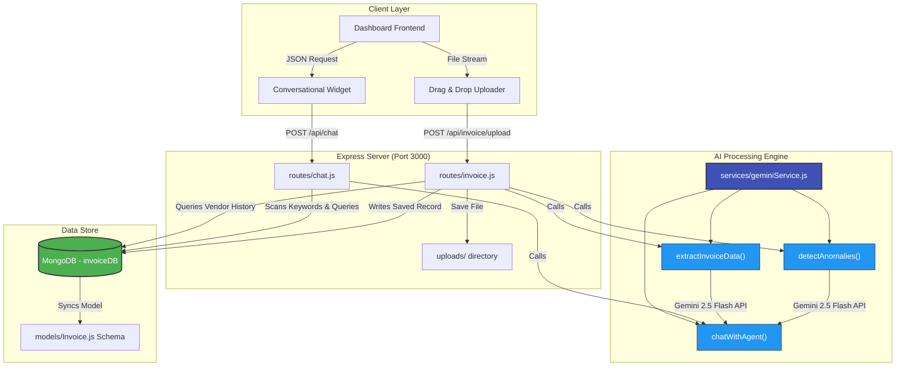

```
 ___ _   ___     ______ ___ ___ ___     _   ___ ___ _  _ _____ 
|_ _| \ | \ \   / /  _ \_ _/ __| __|   /_\ / __| __| \| |_   _|
 | ||  \| |\ \ / /| |_) | | (__| _|   / _ \ (_ | _| | .` | | |  
|___|_| \_| \_V_/ |____/___\___|___| /_/ \_\___|___|_|\_| |_|  
```

### AI-Powered Invoice Extraction & Anomaly Detection Agent
**Autonomous · Context-Aware · Reasoning-Driven**

[](https://nodejs.org/)
[](https://aistudio.google.com/)
[](https://www.mongodb.com/)
[](https://www.docker.com/)
[](https://opensource.org/licenses/MIT)

> [!NOTE]
> The **Invoice Processing Agent** is an end-to-end autonomous pipeline engineered to automate corporate financial audits. Using Google Gemini 2.5 Flash, the agent bypasses standard OCR limitations by executing reasoning-driven semantic data extraction on multi-format invoices. It saves the structured records to MongoDB, retrieves vendor payment history, and performs real-time anomaly detection—flagging suspicious changes in rates, duplicates, billing frequencies, or addresses. An integrated multi-turn chat widget allows the finance team to ask natural-language questions grounded in the collected database records.

---

### [Documentation](#documentation) · [Quick Start](#quick-start) · [Features](#key-features) · [Architecture](#system-architecture) · [Endpoints](#api-endpoints)

---

## Table of Contents

| Section | Description | Target |
| :--- | :--- | :--- |
| **1. Overview & Features** | Key Capabilities & Core Strengths | [Key Features](#key-features) |
| **2. Architectural Design** | Diagrams, Mermaid Graphs & Pipeline Layers | [System Architecture](#system-architecture) |
| **3. Execution Walkthroughs** | Anomaly Alerts & Grounded Conversation Examples | [Example Walkthrough](#example-walkthrough) |
| **4. Technical Specification** | Codebase Tree, Prompt Engineering & API Maps | [Project Structure](#project-structure) |

---

## Key Features

| Icon | Feature | Description |
| :---: | :--- | :--- |
| 👁️ | **Multimodal Extraction** | Bypasses OCR text layout constraints by analyzing PDF and image invoices directly. |
| 📝 | **Structured JSON Output** | Enforces a strict type-safe schema map representing items, totals, vendor data, and currencies. |
| 🛡️ | **Anomaly Detection** | Compares current transactions against up to 20 historical documents for the same vendor. |
| 💬 | **Conversational Chat Agent** | Real-time chat widget grounded in active MongoDB data with in-memory session tracking. |
| 📁 | **Mongoose Persistence** | Compound indexing on `vendor_name` and `invoice_number` for fast lookups. |
| 🐋 | **Docker Orchestration** | Isolated multi-container environments running Node 20 and MongoDB 7 out of the box. |
| ⚠️ | **Composite Risk Scoring** | Synthesizes extraction risk and history anomalies to score safety levels (Low / Med / High). |

---

## Why an Agent, Not a Script

| Capability | Traditional OCR/Rule-based Script | Invoice Processing Agent |
| :--- | :--- | :--- |
| **Input Method** | Relies on hardcoded coordinates or positional regex templates. | Processes raw pixel layout natively using Gemini vision context. |
| **Reasoning** | Boolean conditions; fails on unstructured variations. | Evaluates line items and totals to determine semantic meaning. |
| **Historical Context**| Standard script evaluates the current file in isolation. | Automatically queries MongoDB for vendor history context. |
| **Anomaly Detection** | Limited to exact duplicate checks. | Analyzes rate spikes, frequency trends, and address alterations. |
| **Extensibility** | Rewriting regex/parsing rules is required for each template. | Standardized prompt handles new layouts out of the box. |

---

## System Architecture

### Processing Pipeline

```
[ User Invoice ]
       │ (Uploads via Drag-and-Drop)
       ▼
 [ Frontend UI ]
       │ (Multipart/Form-Data Post)
       ▼
 [ Express Router ] ──(Saves to Disk)──► [ local /app/uploads ]
       │
       ├─► [ Gemini API Layer ] ──► (1. Multimodal Extraction & Parsing)
       │         │
       │         ▼ (Extracted JSON: Vendor Name, Total, Line Items)
       │
       ├─► [ MongoDB Query ] ────► (Retrieves Past Vendor Invoices)
       │         │
       │         ▼ (Context Data Array)
       │
       ├─► [ Anomaly Engine ] ───► (2. Gemini Cross-Invoice Comparison)
       │         │
       │         ▼ (Composite Risk Scoring & Anomaly Flags)
       │
       └─► [ Database Save ] ────► [ MongoDB Document Store ]
                 │
                 ▼ (201 Created Response)
           [ Dashboard Result Card & Chat Terminal ]
```

### Class Relationship Graph



### Processing Pipeline Layers

| Layer | Purpose | Key Technology | Output |
| :--- | :--- | :--- | :--- |
| **Layer 1: Extraction** | Transforms raw image/PDF data into structured types. | Gemini 2.5 Flash (Vision) | Structured JSON (vendor, totals, line items) |
| **Layer 2: Retrieval** | Assembles past transactions to establish baseline context. | MongoDB Mongoose Query | Lean array of up to 20 past invoice objects |
| **Layer 3: Reasoning** | Executes cross-invoice anomaly scan and safety scoring. | Gemini 2.5 Flash (Text) | Anomaly flags list, risk assessment, reasoning |

---

## Example Walkthrough

```text
[SYSTEM] Invoice "invoice-2026-07.pdf" uploaded successfully (2.4 MB).
[SYSTEM] Processing Layer 1 (Data Extraction)...
[SYSTEM] Gemini parsed: Vendor="Acme Corp", Invoice No="ACME-902", Date="2026-07-02", Total="$14,500.00".
[SYSTEM] Processing Layer 2 (History Retrieval)...
[SYSTEM] Querying MongoDB: found 5 past invoices for "Acme Corp".
[SYSTEM] Processing Layer 3 (Anomaly Reasoning)...
[SYSTEM] Gemini Anomaly Engine completed audit. Result:

⚠️  RISK ASSESSMENT: HIGH
⚑  DETECTED ANOMALIES:
   - "Duplicate Invoice Number: ACME-902 matches a transaction from 2026-05-15."
   - "Total Amount Spike: $14,500.00 is 141.6% higher than vendor average ($6,000.00)."
   - "Address Alteration: Billing address changed from '123 Main St' to '999 Private Ave'."

💡  REASONING:
   - High risk flagged due to duplicate invoice ID conflicts and structural modifications to the billing address, which matches impersonation profiles. Invoice total represents a massive pricing anomaly. Immediate manual review recommended.
```

---

## Chat Agent Example

```text
User: How much have we spent with Acme Corp so far, and are there any concerns?

Agent: We have spent a total of $30,000.00 with Acme Corp across 5 completed invoices.

There is 1 active concern:
- The most recent invoice (ACME-902) was flagged as HIGH RISK because the amount ($14,500.00) is more than double their historical average of $6,000.00, and the billing address changed to "999 Private Ave". 

I recommend holding payment on ACME-902 until these discrepancies are cleared.
```

---

## Project Structure

```text
Recipt_AI_Agent/
├── Dockerfile                  # Multi-stage production build configuration
├── docker-compose.yml          # Container configuration for Node & MongoDB 7
├── package.json                # Project dependencies and startup scripts
├── server.js                   # Application bootstrap and routing middleware
├── .dockerignore               # Cache optimization directory exclusions
├── .env.example                # Template for local environment parameters
├── models/
│   └── Invoice.js              # Mongoose Schema (snake_case, indexes, validation)
├── public/                     # Static client frontend files (Express served)
│   ├── index.html              # Drag-and-drop panel and result card markup
│   ├── style.css               # Dark-mode glassmorphism stylesheet
│   └── script.js               # Client controller (XSS escape, API calls, Chat)
├── routes/
│   ├── invoice.js              # Endpoint router (file upload, history pagination)
│   └── chat.js                 # Chat endpoint router (retrieval context matching)
└── services/
    └── geminiService.js        # Google Generative AI configurations & prompts
```

---

## Prompt Engineering Approach

The agent relies on three target prompts designed for zero-shot performance and grounded reasoning:

1.  **Extraction Prompt:** Instructs Gemini to evaluate spatial layouts and output standard JSON keys matching our Mongoose model. All schema parameters are explicitly mapped (e.g. `subtotal`, `tax`, `line_items`), preventing typical markdown code block formatting.
2.  **Anomaly Detection Prompt:** Injects the current invoice JSON alongside historical data context. Instructs Gemini to compare parameters against the baseline, looking for address anomalies, invoice number collisions, tax rate spikes, or extreme total fluctuations.
3.  **Chat Agent System Instruction:** Instructs the assistant to operate strictly on the database context. Hallucinations are minimized by the rule: *If context is insufficient to answer, respond: "I don't have enough invoice data to answer that — could you upload more invoices or rephrase your question?"*

---

## Quick Start

### 1. Clone and Configure
Clone this project to your directory, copy `.env.example`, and populate your Gemini API key:
```bash
cp .env.example .env
```
Update `.env` values:
```env
GEMINI_API_KEY=AIzaSy...your_gemini_key_here
```

### 2. Run Containerized (Docker)
Build and run both the Express backend and MongoDB database:
```bash
docker-compose up --build -d
```
Access the application at **[http://localhost:3000](http://localhost:3000)**.

### 3. Run Locally (Alternative)
Install local project packages and run Node:
```bash
npm install
node server.js
```
Access the application at **[http://localhost:5000](http://localhost:5000)**. *(Ensure a local MongoDB instance is running on port 27017).*

---

## API Endpoints

| Method | Endpoint | Description |
| :--- | :--- | :--- |
| `POST` | `/api/invoice/upload` | Uploads raw invoice, executes Gemini extraction, history query, anomaly audit. |
| `GET` | `/api/invoice/history` | Fetches paginated list of processed invoices with risk/vendor filter queries. |
| `GET` | `/api/invoice/:id` | Returns complete Mongoose document mapping (includes AI raw responses). |
| `DELETE`| `/api/invoice/:id` | Deletes the database record and removes the file asset from disk. |
| `POST` | `/api/chat` | Receives conversation turns, queries context from MongoDB, returns response. |

---

## Configuration

| Variable | Default Value | Purpose |
| :--- | :--- | :--- |
| `PORT` | `3000` (Docker) / `5000` (Local) | Specifies the port the Express application server binds to. |
| `MONGO_URI` | `mongodb://mongo:27017/invoiceDB` | Connection string pointing to the MongoDB container database. |
| `GEMINI_API_KEY`| *(None)* | Required Google generative AI authorization key. |
| `UPLOAD_DIR` | `uploads` | Folder path where uploaded invoices are cached prior to processing. |

---

## Tech Stack

*   **Runtime:** [Node.js](https://nodejs.org/) (v20) & [Express.js](https://expressjs.com/)
*   **AI Model:** [Google Gemini 2.5 Flash API](https://aistudio.google.com/)
*   **Database:** [MongoDB](https://www.mongodb.com/) & [Mongoose ORM](https://mongoosejs.com/)
*   **Client Interface:** Vanilla HTML5, CSS3 Grid/Flexbox, ES6 Javascript
*   **Deployment:** [Docker](https://www.docker.com/) & [Docker Compose](https://docs.docker.com/compose/)

---

## Roadmap

| Stage | Status | Description |
| :---: | :---: | :--- |
| **Core Extraction** | `DONE` | Direct multimodal parsing of PDF/Image layouts to structured JSON mapping. |
| **Anomaly Detection**| `DONE` | Comparison of current invoices against historical vendor parameters. |
| **Chat Agent Interface** | `DONE` | Interactive chat widget with database context matching. |
| **Orchestration** | `DONE` | Dockerfile build configurations and network bridge deployment. |
| **Vector DB Search** | `PLANNED` | Implement Milvus/Pinecone for semantic line item matching across all vendors. |
| **Multi-user Auth** | `PLANNED` | OAuth2 integration (Google/GitHub) and role permissions (Read/Write/Approve). |
| **PDF Reporting** | `PLANNED` | Exportable PDF accounting audits and threat reports. |

---

## Screenshots

*Placeholders to be populated after deployment:*

```markdown

*Figure 1: Main Dashboard layout demonstrating drag uploader and invoice history list.*


*Figure 2: Interactive conversational assistant widget analyzing spending history.*
```

---

## Live Demo & Repository

- **GitHub Repository:** [https://github.com/ARULAMUTHAN1/Invoice_Agent.git](https://github.com/ARULAMUTHAN1/Invoice_Agent.git)
- **Local Deployment URL:** [http://localhost:3000](http://localhost:3000)

---

## Author

- **Name:** *Arulamuthan*
- **Role:** *Full Stack Developer & AI Engineer*
- **Institution:** *[College Name Placeholder]*

---

*Built with Gemini AI, Node.js, and MongoDB | 2026 Invoice Processing Agent*
